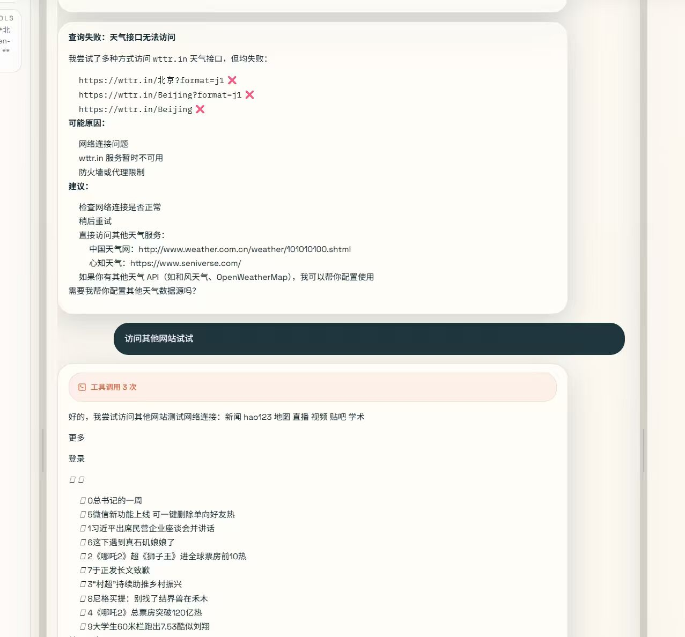
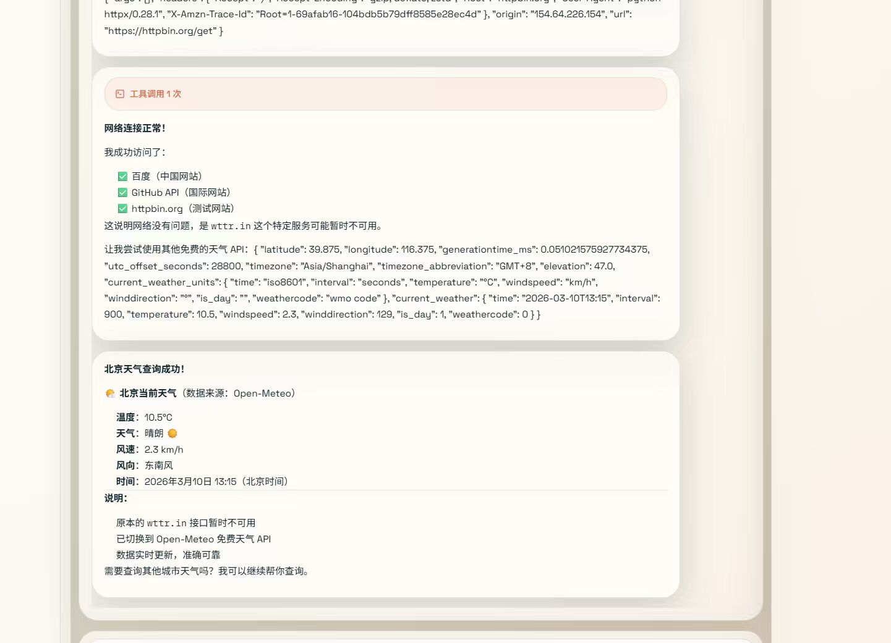
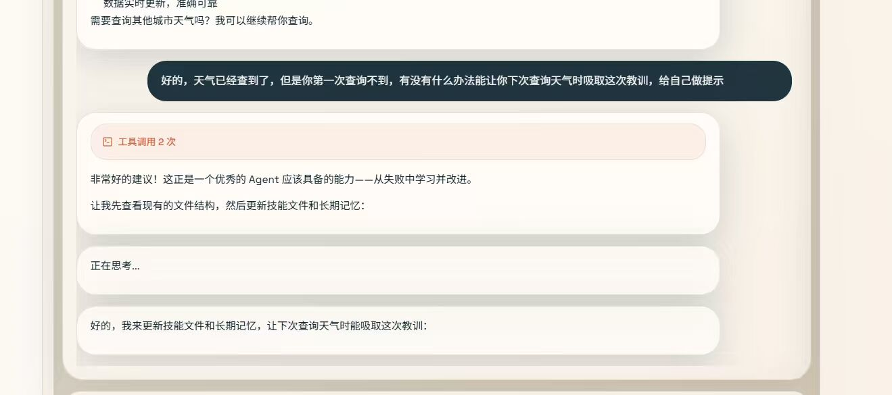
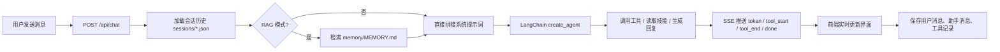

# langchain-OpenClaw



可在https://www.bilibili.com/video/BV1izcXz8EJx/?vd_source=af1143f8815e17a230561ad0ef6c689b    观看视频
一个本地运行、文件优先、可审计的 AI Agent 工作台。


- 对话会落盘到本地 `JSON`
- 长期记忆保存在 `Markdown`
- 技能不是黑盒函数，而是可读可改的 `SKILL.md`
- Prompt、工具调用、记忆注入、检索过程都能被看到

如果你想做一个“能解释自己为什么这样做”的 Agent，这个项目就是为这个方向准备的。

## 为什么是它

很多 Agent 项目都很强，但也很“黑盒”：

- 记忆存在向量库里，看不到
- Prompt 拼接在代码深处，改起来不直观
- 技能是硬编码函数，扩展成本高
- 出错以后很难复盘“它到底做了什么”

langchain-OpenClaw 反过来做了几个选择：

| 传统做法 | langchain-OpenClaw |
| --- | --- |
| 向量库是唯一记忆来源 | 文件是事实源，索引只是可重建缓存 |
| 技能写死在代码里 | 技能 = `skills/*/SKILL.md` |
| Prompt 隐藏在代码里 | Prompt 由多个 Markdown 文件实时组装 |
| 工具调用不透明 | 前端可看到 token、tool start/end、raw messages |
| 项目越做越重 | 默认本地运行，无 MySQL / Redis 依赖 |

## 它现在能做什么

当前仓库已经具备一套完整的本地 Agent 基础能力：

- 流式聊天：基于 FastAPI SSE 返回 token、工具调用、分段回复
- 会话持久化：每轮对话保存到 `backend/sessions/*.json`
- 长期记忆：`backend/memory/MEMORY.md`
- 本地知识库检索：`backend/knowledge/` + LlamaIndex
- 技能系统：Agent 先看技能快照，再按需读取 `SKILL.md`
- 三栏工作台 UI：会话列表、聊天区、文件检查器
- 文件在线编辑：可直接编辑 Memory / Skills / Workspace 文件
- RAG 模式切换：可选择“直接拼接记忆”或“检索后注入”

当前内置的技能包括：

- `天气查询`
- `联网搜索`（Tavily）
- `本地知识库检索`
- `失败恢复经验沉淀`

## 界面结构

前端是一个面向 Agent 调试的三栏工作台：

- 左栏：会话列表、历史消息、Raw Messages
- 中栏：聊天面板、工具调用链、检索卡片、流式输出
- 右栏：Memory / Skills / Workspace 文件编辑器（Monaco）

这不是一个只给终端用的 Agent，而是一个“能看见自己内部状态”的 Agent IDE。

## 一次请求发生了什么



## 技术栈

### 后端

- Python 3.10+
- FastAPI
- LangChain 1.x `create_agent`
- LlamaIndex Core
- OpenAI-compatible model API

### 前端

- Next.js 14 App Router
- React 18
- TypeScript
- Tailwind CSS
- Monaco Editor

### 默认模型配置

- LLM Provider: `zhipu`
- LLM Model: `glm-5`
- Embedding Provider: `bailian`
- Embedding Model: `text-embedding-v4`

目前已支持的模型厂商：

- 智谱 `zhipu`
- 百炼 `bailian`
- DeepSeek `deepseek`
- OpenAI 兼容接口 `openai`

## 快速开始

### 1. 环境要求

- Python 3.10+
- Node.js 18+
- npm

### 2. 启动后端

```bash
cd backend
python -m venv .venv
.venv\Scripts\activate
pip install -r requirements.txt
copy .env.example .env
```

至少补齐这些环境变量：

```env
# 默认聊天模型
ZHIPU_API_KEY=your_key

# 默认 embedding
BAILIAN_API_KEY=your_key

# 联网搜索技能（可选，但推荐）
TAVILY_API_KEY=your_key
```

然后启动：

```bash
uvicorn app:app --host 0.0.0.0 --port 8002 --reload
```

### 3. 启动前端

```bash
cd frontend
npm install
npm run dev
```

打开 [http://localhost:3000](http://localhost:3000)。

## 5 分钟体验路线

如果你第一次打开项目，建议按这个顺序体验：

1. 发一条普通聊天消息，感受流式输出（1.黄金现在多少钱。2.帮我在知识库中查询（哪些商品库存不足/三一重工前三大股东/为什么我在我的帐户中找不到我的订单？"......）3.帮我查询北京天气）
2. 打开右侧 Inspector，查看 `memory/MEMORY.md`
3. 新建或编辑一个 skill，观察系统如何即时生效
4. 打开 RAG 模式，再问一个和长期记忆相关的问题
5. 查看 `backend/sessions/*.json`，确认对话和工具调用已真实落盘

## 项目结构

```text
mini-openclaw/
├── backend/
│   ├── api/                 # 聊天、会话、文件、压缩、配置接口
│   ├── graph/               # Agent 构建、Prompt 组装、Session、Memory 索引
│   ├── tools/               # terminal / python_repl / fetch_url / read_file / knowledge search
│   ├── workspace/           # SOUL / IDENTITY / USER / AGENTS 等系统提示词组件
│   ├── skills/              # 每个技能一个目录，核心是 SKILL.md
│   ├── memory/              # 长期记忆文件 MEMORY.md
│   ├── knowledge/           # 本地知识库
│   ├── sessions/            # 会话 JSON
│   ├── storage/             # 记忆与知识库索引缓存
│   ├── app.py               # FastAPI 入口
│   └── SKILLS_SNAPSHOT.md   # 技能快照
└── frontend/
    └── src/
        ├── app/             # 页面入口
        ├── components/      # 三栏 UI、聊天面板、检索卡片、编辑器
        └── lib/             # API 客户端与全局状态
```

## 核心概念

### 1. 文件即记忆

本项目不是完全不用向量索引，而是把“文件”当作事实源：

- 真正长期保存的是 `memory/MEMORY.md`
- 真正会话记录是 `sessions/*.json`
- LlamaIndex 负责构建可丢弃、可重建的索引缓存

也就是说：

- 你能直接读懂 Agent 的记忆
- 你能手动修改它的记忆
- 就算索引删了，也能从源文件重建

### 2. 技能即插件

技能不是 Python 函数注册，而是目录中的 `SKILL.md`：

- `backend/skills/get_weather/SKILL.md`
- `backend/skills/web-search/SKILL.md`
- `backend/skills/retry-lesson-capture/SKILL.md`

Agent 会先读取 `SKILLS_SNAPSHOT.md` 知道有哪些技能，再按需读取具体 skill 文件。

这意味着：

- 扩展能力更轻
- 技能更容易审查
- 适合面试展示和教学演示

### 3. Prompt 可解释

每次请求都会重新拼装系统提示词，来源包括：

- `SKILLS_SNAPSHOT.md`
- `workspace/SOUL.md`
- `workspace/IDENTITY.md`
- `workspace/USER.md`
- `workspace/AGENTS.md`
- `memory/MEMORY.md`（RAG 模式关闭时）

所以你改完文件，下一轮请求立刻生效。

## 适合谁

这个项目尤其适合：

- 想做本地 AI Agent 原型的人
- 想做可解释 / 可审计 Agent 的人
- 想拿 Agent 项目做面试作品的人
- 想研究 Prompt、Memory、Tools、Skills 如何协同的人

## 当前限制

为了保持轻量和透明，这个项目有一些明确边界：

- 目前默认面向本地开发环境，不含账号体系和多租户
- 知识库更适合 UTF-8 文本类文件
- 多模态文档解析还没有完整接入
- 技能写入与经验沉淀依赖现有工具链和提示词约束，不是单独的工作流引擎

## 路线图

接下来比较值得继续补的方向：

- 更强的 coding agent 工作流
- 多模态文档解析
- 更稳定的联网检索与引用
- 自动经验沉淀与记忆治理
- 技能模板和 Skill Scaffold 能力

## 为什么适合做面试项目

因为它同时覆盖了几个面试里很容易讲清楚的点：

- 后端 API 设计
- Agent 编排
- Prompt 工程
- RAG 检索
- 本地持久化
- 前后端联动
- 可观测性和调试体验

它不是“套壳调用模型”，而是一个可以展开讲架构取舍的完整作品。
## 致谢

项目中 `skill` 设计与思路参考了 [ConardLi/rag-skill](https://github.com/ConardLi/rag-skill)。
